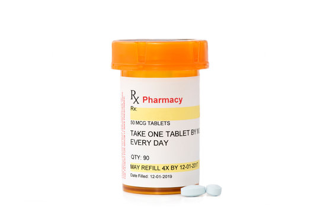
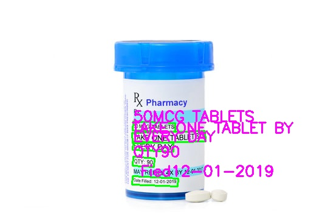

# prescription_reader-ineuron.ai

## Overview

The **Prescription OCR and Text-to-Speech Converter** is a web application designed to extract text from images of prescriptions and convert that text into spoken audio. This project leverages PaddleOCR for text extraction and Google Text-to-Speech (gTTS) for audio conversion.

### Project Link : 

## Project Setup

### Dependencies

This project requires several Python libraries. Ensure you have the following packages installed:

- `opencv-python` for image processing.
- `paddleocr` for optical character recognition.
- `gtts` for text-to-speech conversion.
- `streamlit` for the web interface.
- `numpy` for numerical operations.
- `io` for handling in-memory files.

You can install these dependencies using `pip install -r requirements.txt`:

### Files
- `image_reader.py`: Contains the core functionality for the OCR and TTS processes.
- `ImageToText` class: Extracts text from images and visualizes the OCR results.
- `TextToSpeech` class: Converts text to speech and provides options for saving and playing audio.
- `app.py`: The main script that runs the Streamlit web application. This file handles the user interface, allowing users to upload images, extract text, and convert text to speech.

### Input Image

### Results

[downloaded audio](result_audio.mp3)
